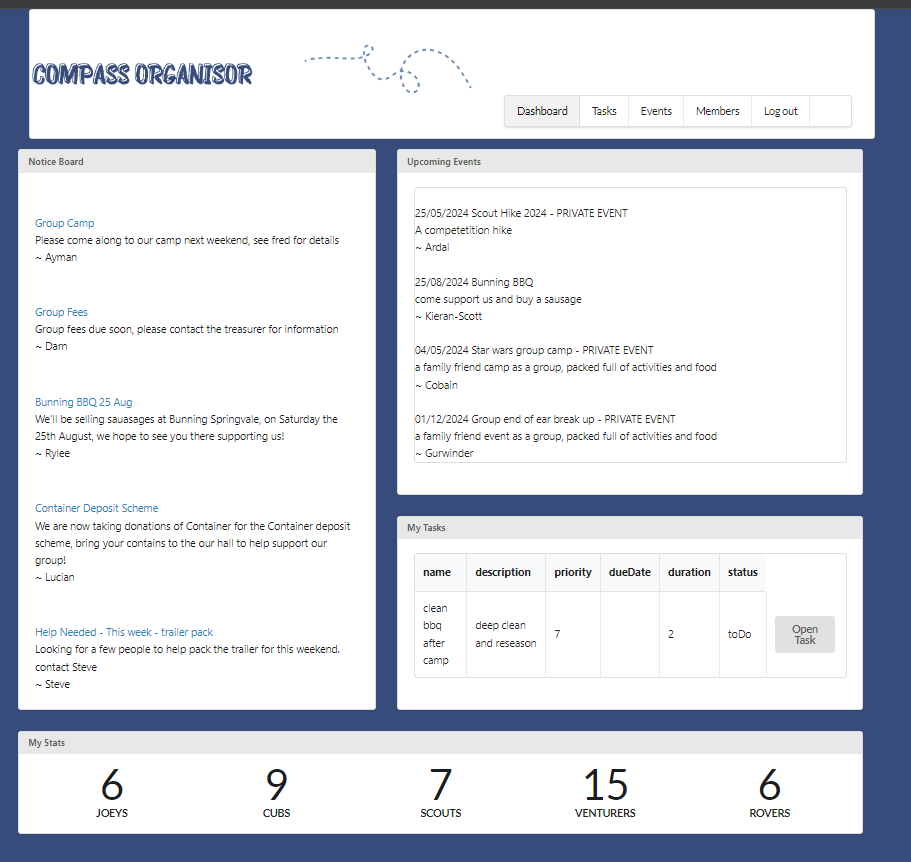
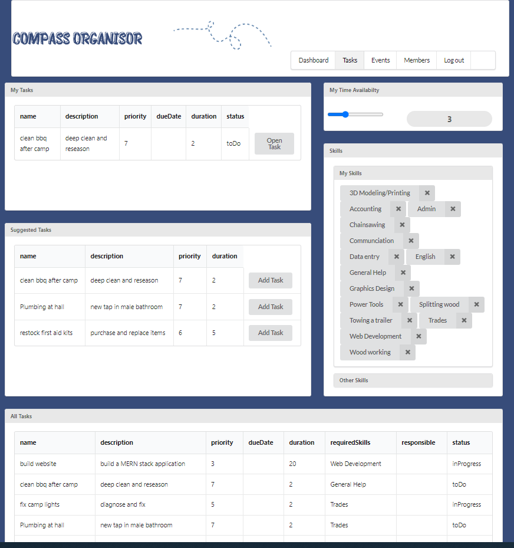
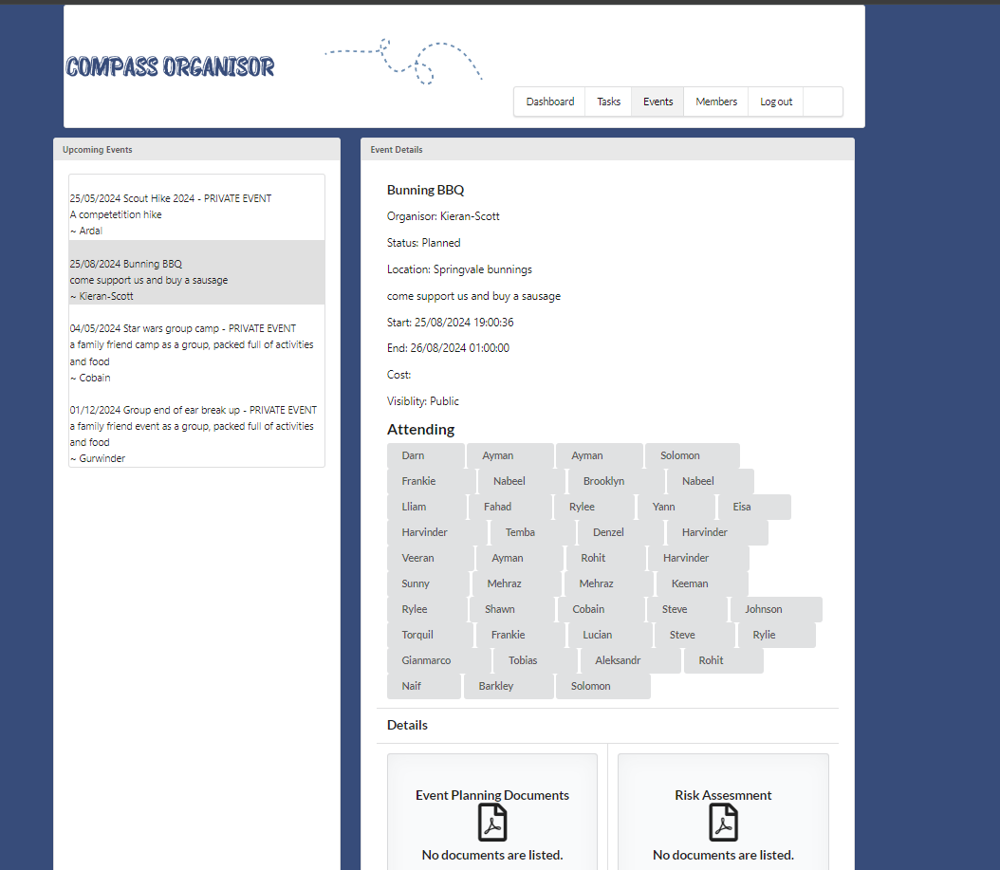
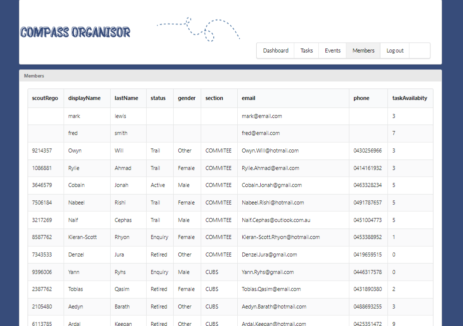

# Bootcamp Project #3 - Full Stack Application: Compass Organisor
[](https://opensource.org/licenses/MIT)


## Description

The purpose of this application is to help manage a scout group or similar organisation. Scout groups have a range of processes, from planning weekly programs to larger activities to building maintenance.

Currently, there are existing systems that assist in managing scout groups, but these are often fragmented or leave significant gaps as they are not specifically tailored to our needs. This situation often forces each group to create their own system, often spreadsheets for days, leading to inefficiencies and inconsistencies. This project aims to address this issue by providing a comprehensive solution for one scout group.

One significant point that I hope to address is the delegation of tasks within a volunteer organisation. Task allocation could benefit from having a shared to-do list that is allocated based on two primary weights: required skills and available time. So that people can help out when they have time and spread the load.
Often, tasks are left undelegated and remain the chore of the ‘manager’ because the top is too busy to find someone with the available time and required skills


## Table of Contents
    
- [User Story](#user-story)
- [Acceptance Criteria](#acceptance-criteria)
- [Installation](#installation)
- [Testing](#testing)
- [Usage](#usage)
- [Screenshots/Video](<#screenshots--video-of-completed-challenge>)
- [License](#license)
- [Credits](#credits)
- [Questions / How to Contribute](#questions--how-to-contribute)

## User Story

```
AS A  group leader of a scout group, I WANT A system that allows me to oversee and manage the tasks or running a scout group SO THAT I can ensure my group is moving forward instead of being tied to old fragmented systems
```

## Acceptance Criteria

```
When I open the website
Then i am presented with a website of the scout group
When i click login
Then i am prompted to login of sign to the site.
When i first log in.
Then i am presented with a dashboard of the information relating to my role within the group, a group notice board, a list of upcoming events and the tasks available for my skill set.
When i view the member lists,
Then  i see the members that i am responsible for. Ie youth members or committee team members etc. 
When i add a task 
Then it is added to the database, and appears on my dashboard. And the dashboard of the suitable people
When i add an event, 
then it is added to the database and displayed on my dashboard
When i open an event
Then i can update the details and add attendees and request payment

```

## Technologies
Node.js, Express, React, MongoDb, Mongoose ODM, GraphQl, Semantic UI


## Installation

then from the terminal inside the 'develop' directory, run the following command to install the necessary dependancies.
       
    npm install
    npm run start


## Testing

No self tests exist for this application.

## Usage
    
Open the terminal in the 'develop' Folder and enter the following command.

    npm run start

Then open the application in the browser


## GitHub repository
https://github.com/mlewis89/Compass-Organiser

## Heroku Hosting
https://compass-org-ad344bf9f240.herokuapp.com/

## Screenshots of Completed Challenge






## License
This project is licensed under the MIT.
    
## Questions / How to Contribute
    
If you have any questions about the repo, open an issue. You can veiw my other work on git hub [mlewis89](https://github.com/mlewis89/)

## Credits

Monash University Full Stack Coding bootcamp


---
